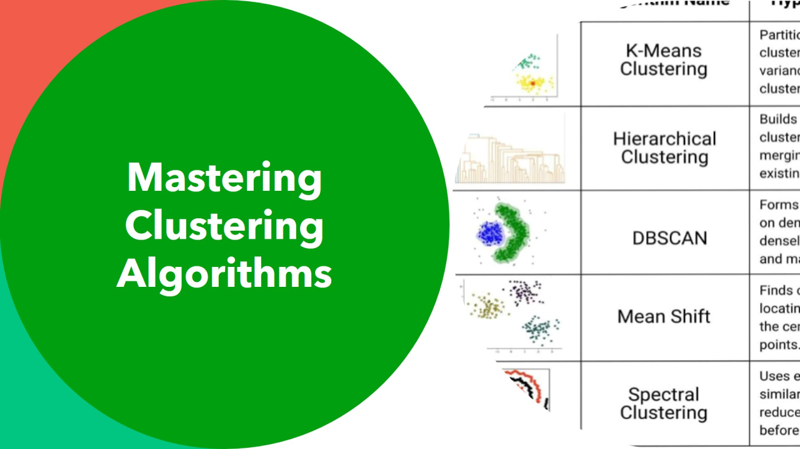
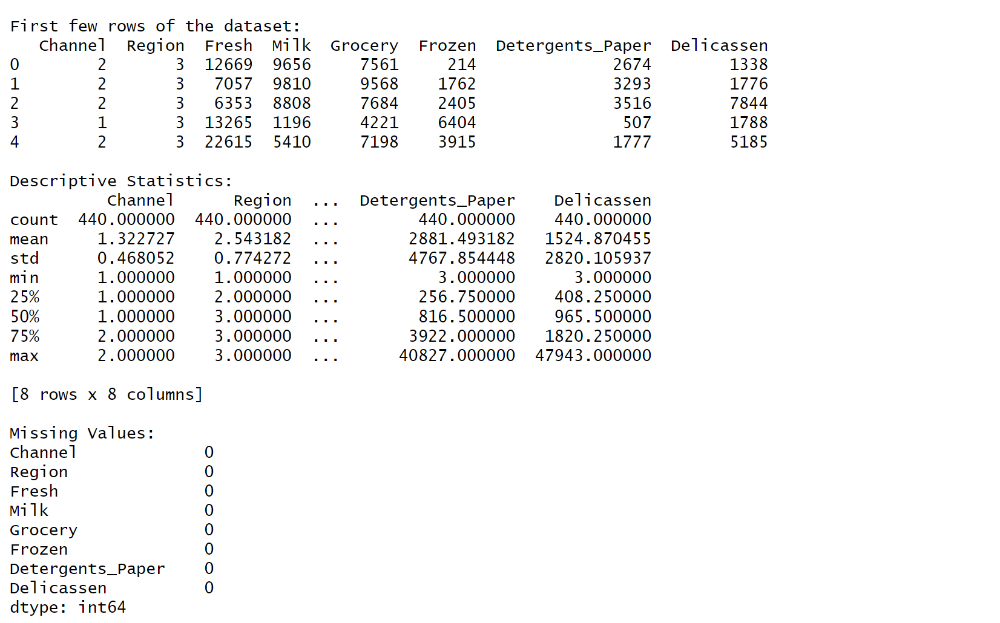
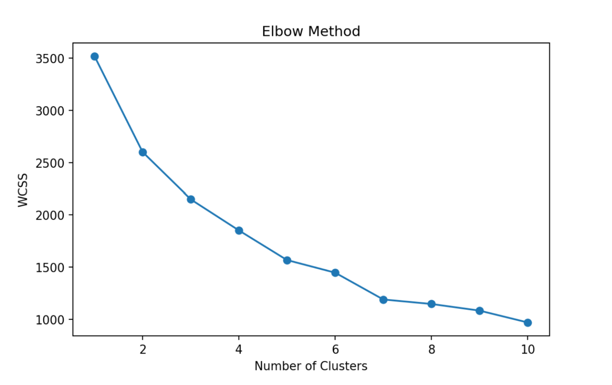
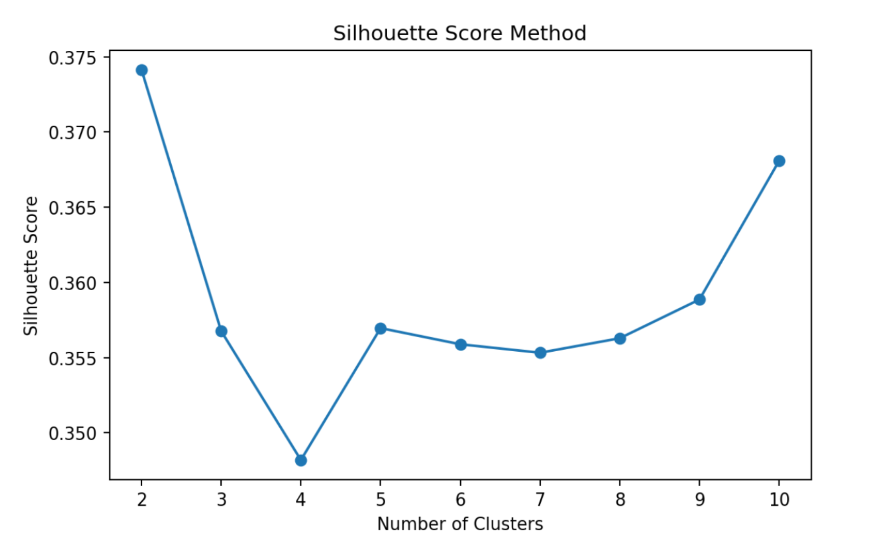
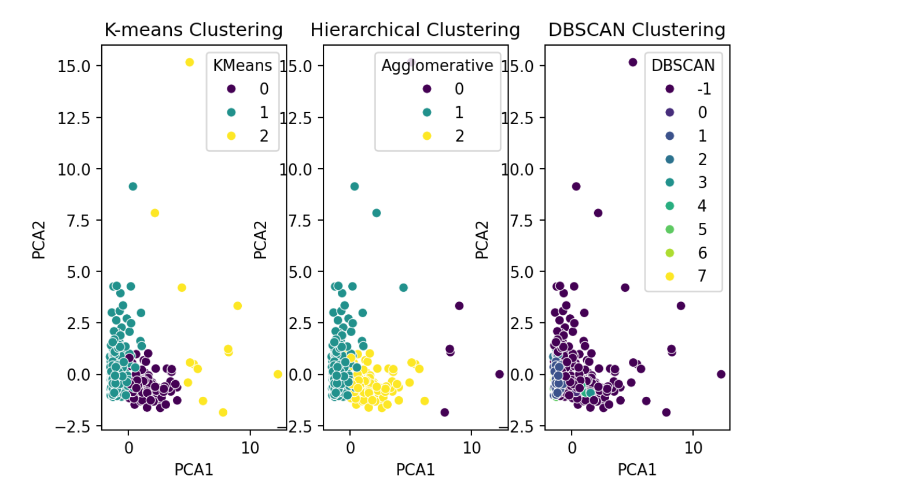
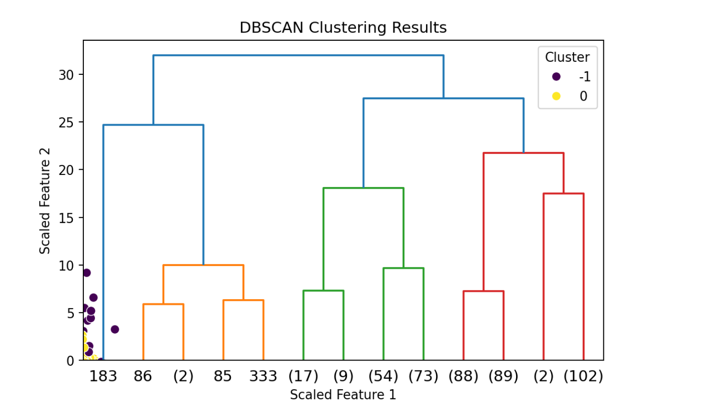

# Cluster-Analysis-of-Wholesale-Customers-Using-K-Means-Hierarchical-Clustering-and-DBSCAN

# Introduction

Cluster analysis is a statistical method used to group similar objects or data
points into clusters based on their characteristics or features. The goal is to
ensure that items within the same cluster are more similar to each other than to
those in other clusters. This technique is widely used in fields such as data
mining, machine learning, and pattern recognition, helping researchers and
analysts uncover hidden patterns, relationships, and structures within large
datasets.

The significance of cluster analysis lies in its ability to simplify complex
data by organizing it into meaningful groups, enabling better insights and
decision-making. For example, in marketing, cluster analysis can help identify
distinct customer segments, allowing companies to tailor their products and
services to meet specific needs. In biology, it can group genes or species based
on similarities, aiding in the understanding of evolutionary relationships.
Overall, cluster analysis is a powerful tool for exploring data, identifying
trends, and informing strategies across various domains.

# Dataset Description

The Wholesale Customers Dataset will be used to analyze purchasing patterns of
various wholesale customers. This dataset includes information on the annual
spending of different customers on various product categories. It provides
insights into customer segmentation based on spending behavior across multiple
product types. Here’s a summary of the key attributes:

## Attributes:

**Channel:** Specifies the type of customer channel (e.g., Horeca -
Hotel/Restaurant/Café or Retail). This attribute acts as a categorical label but
is usually not involved in clustering.

**Region:** Indicates the geographical region where the customer is located
(e.g., Lisbon, Oporto, or other regions).

**Fresh:** Annual spending on fresh produce (e.g., fruits, vegetables).

**Milk:** Annual spending on milk products.

**Grocery:** Annual spending on grocery items.

**Frozen:** Annual spending on frozen products.

**Detergents_Paper:** Annual spending on cleaning products such as detergents
and paper.

**Delicatessen:** Annual spending on delicatessen items (specialty foods,
high-quality prepared foods).

## Class Labels:

The dataset doesn’t have pre-defined class labels as it’s primarily designed for
unsupervised learning (e.g., clustering). However, the Channel and Region
columns can provide useful context for interpreting clusters or validating the
segmentation by customer type or location.

## Descriptive statistics for the dataset

AS shown in fig 1, the summary statistics, including mean, standard deviation,
minimum, and maximum values, reveal the data distribution and variability within
each category. For instance, 'Detergents_Paper' has a large range, indicating
varied spending levels. Additionally, there are no missing values in any column,
confirming that the dataset is complete and ready for further analysis.

# Methodology

## Preprocessing Steps

Before applying cluster analysis, the data underwent several preprocessing steps
to ensure quality and enhance the accuracy of clustering:

### Data Cleaning:

I began by checking for missing values in the dataset. No missing values were
found, indicating that the data was complete. Following the descriptive
analysis, the dataset was confirmed to be in good shape and ready for further
analysis.

### Normalization/Standardization:

To prevent features with larger ranges from dominating the clustering results,
numerical features were normalized to a standard scale, typically using
standardscaler.

### Feature Selection:

Redundant or irrelevant features were removed to reduce noise and computational
complexity. Principal Component Analysis (PCA) was applied if dimensionality
reduction was required, retaining components that explained the majority of the
variance.

## Algorithms Chosen

For this cluster analysis, three primary algorithms were selected based on the
data characteristics and clustering objectives:

### K-Means Clustering:

This popular algorithm was chosen for its simplicity and efficiency in handling
large datasets. K-Means partitions data into K clusters by minimizing the
within-cluster variance. The optimal number of clusters was determined using the
Elbow Method and Silhouette Score.

### Hierarchical Clustering:

This algorithm was used to provide a dendrogram, which visually represents the
hierarchical relationships between data points. Agglomerative clustering was
chosen with Ward's linkage method, which minimizes the variance within clusters.
This approach was helpful for identifying the underlying structure of the data
without specifying the number of clusters in advance.

### DBSCAN Clustering:

The DBSCAN (Density-Based Spatial Clustering of Applications with Noise)
algorithm was applied to identify clusters based on the density of data points,
allowing for the detection of irregularly shaped clusters and outliers. Unlike
K-means or hierarchical clustering, DBSCAN does not require a predefined number
of clusters. Instead, it uses two key parameters—eps (maximum distance between
points in a cluster) and min_samples (minimum points required to form a
cluster)—to form dense regions. This method was effective for capturing clusters
of varying shapes and isolating noise points in the dataset.

## Modifications Made

To enhance the clustering performance and tailor the algorithms to our specific
dataset, the following modifications were made:

### Optimal Cluster Number Selection:

For K-Means, in addition to the Elbow Method, the Silhouette Score was used to
validate the number of clusters, providing a more data-driven approach to
cluster selection.

### Hybrid Approach:

In cases where K-Means alone did not capture the data structure effectively,
hierarchical clustering was applied to the K-Means results, combining the
strengths of both methods.

### Distance Metric Adjustment:

Euclidean distance was used for K-Means clustering, while hierarchical
clustering allowed flexibility to experiment with different distance metrics
(e.g., Manhattan, cosine) to better fit the data characteristics. These
preprocessing steps, algorithm choices, and modifications helped ensure robust
and interpretable clustering results, aligning with the objectives of uncovering
meaningful patterns and relationships in the dataset.

# Results

## Optimal Number of Clusters

The Elbow Method plot fig 2 shows a significant decrease in Within-Cluster Sum
of Squares (WCSS) as the number of clusters increases. However, after 3
clusters, the rate of decrease slows, indicating diminishing returns. This
"elbow" suggests that 3 clusters might be a good choice, balancing simplicity
and explained variance.

The Silhouette Score plot fig 3 also supports this choice. The highest
silhouette score occurs at 2 clusters, but it remains relatively high at 3
clusters before dropping sharply at 4 clusters. Thus, based on both WCSS and
silhouette scores, 3 clusters is a suitable option for this dataset.

## Clustering Performance Metrics

To evaluate the clustering quality of each algorithm, we used metrics such as
Silhouette Score and Within-Cluster Sum of Squares (WCSS) for K-means. The
results are as follows:

### K-means Clustering (3 clusters):

**Silhouette Score: 0.357** – This moderate score suggests that the clusters are
somewhat distinct, but there is room for improvement in separation.

**WCSS: 2149.284** – The Elbow Method was used to determine that 3 clusters
provide a reasonable trade-off between cluster compactness and model simplicity.

### Hierarchical Clustering (3 clusters):

**Silhouette Score: 0.360** – Similar to K-means, indicating comparable
clustering quality. The hierarchical structure might capture certain nuances
better, especially if there is an inherent hierarchy in the data.

### DBSCAN:

**Silhouette Score (excluding noise): 0.394** – The highest silhouette score
among the methods. DBSCAN identifies clusters of varying shapes and densities,
as well as noise points. The presence of noise points (labeled as -1) is
beneficial for this dataset if it contains significant outliers or clusters of
varying densities.

## Visual Comparison

Using PCA for dimensionality reduction, we visualized the clusters identified by
each algorithm as shown in Fig4 and Fig5:

**K-means Clustering:** The clusters were fairly compact and separated, with
some overlap.

**Hierarchical Clustering:** Showed similar clusters to K-means, but slightly
more defined due to its hierarchical approach.

**DBSCAN:** Produced clusters that were less compact but adaptable to irregular
shapes, with noise points (outliers) separated from the main clusters.

# Discussion

## Comparison of Clustering Algorithms

### K-means Clustering:

**Strengths:** Simple to implement and computationally efficient. It works well
with well-separated, spherical clusters and provides consistent results when
given a specific number of clusters.

**Weaknesses:** K-means is sensitive to the initial selection of centroids,
cluster shape (assuming spherical clusters), and the presence of outliers. In
this case, the moderate silhouette score (0.357) indicates some overlap between
clusters, potentially due to the complex structure of customer purchasing
patterns.

**Insights:** The clusters formed by K-means likely represent groups of
customers with similar spending habits across major categories. However, due to
the algorithm’s assumptions, K-means may not capture irregularly shaped clusters
or variations in density effectively.

### Hierarchical Clustering:

**Strengths:** Hierarchical clustering is capable of revealing a hierarchical
structure, which can be beneficial if there is a natural hierarchy in the data.
It does not require a predefined number of clusters, allowing for more
flexibility in determining an appropriate number.

**Weaknesses:** Hierarchical clustering can be computationally expensive for
large datasets and may struggle with high-density or noisy data.

**Insights:** Similar to K-means, hierarchical clustering produced moderately
distinct clusters. However, the dendrogram visualization helps reveal potential
sub-clusters within larger clusters, which could offer deeper segmentation
insights if needed. This may highlight sub-groups with subtle variations in
spending behavior.

### DBSCAN:

**Strengths:** DBSCAN is effective at identifying clusters of varying shapes and
densities, as well as separating out noise points (outliers). It does not
require a predefined number of clusters, making it suitable for complex datasets
with varied densities.

**Weaknesses:** DBSCAN is sensitive to parameter selection (eps and
min_samples), which can significantly impact the results. If these parameters
are not chosen well, DBSCAN may either overestimate noise or merge separate
clusters.

**Insights:** DBSCAN achieved the highest silhouette score (0.394), indicating
better-defined clusters than K-means and hierarchical clustering. This algorithm
identified outliers as noise, which could represent customers with unique or
infrequent spending patterns. The flexibility in cluster shape suggests DBSCAN
might capture irregular groupings of customers that traditional algorithms could
miss.

## Customer Segmentation Insights

Based on the clustering analysis, we can provide insights into customer
segmentation:

**Cluster 1 (Moderate spenders):** Found across K-means and hierarchical
clustering, this group likely includes average customers with balanced spending
across multiple categories. Marketing strategies for this group could include
general promotions and loyalty programs to maintain engagement.

**Cluster 2 (High-value customers):** Present in all algorithms, these customers
may show high spending in specific categories, such as "Fresh" or "Frozen"
items. Targeted promotions for premium products or volume discounts could be
effective for this segment.

**Cluster 3 (Low-frequency or niche buyers):** Especially visible in DBSCAN,
this group may contain outliers or low-frequency buyers with irregular spending
habits. Personalized outreach or re-engagement strategies could be effective for
this group. Noise Points (Outliers): Identified by DBSCAN, these points
represent unusual spending patterns that do not fit well into any main segment.
Further analysis may reveal unique needs or occasional buyers, who could benefit
from personalized offers or limited-time discounts.

# Scenarios Where Cluster Analysis May Not Be Suitable or Effective

## Data with No Natural Grouping Structure

**Example:** Financial data for stable, homogeneous customer groups may not
contain significant variation to form meaningful clusters.

**Reason:** If the data lacks natural groupings, clustering will produce
arbitrary segments without useful interpretation, leading to over-segmentation
with little real-world relevance.

## Highly Dynamic or Time-Sensitive Data

**Example:** Stock market data or real-time traffic data, where conditions
change rapidly and clusters may shift frequently.

**Reason:** In dynamic environments, clusters formed today may no longer be
relevant tomorrow. Frequent retraining may not be feasible, and clusters may not
capture meaningful patterns over time.

## Data Where Distance Metrics Are Not Meaningful

**Example:** Text data or data with categorical features that cannot be easily
converted to a meaningful numeric scale.

**Reason:** Clustering often relies on distance metrics (e.g., Euclidean
distance), which may not capture similarity well for non-numeric data, leading
to meaningless clusters. Specialized clustering techniques (e.g., topic modeling
for text) are often more appropriate.

## Applications Requiring Labelled Groups

**Example:** Predictive modeling in healthcare, where specific diagnoses or
categories are needed to guide treatment.

**Reason:** Clustering is an unsupervised method and does not provide labeled
clusters. When labels are necessary, supervised learning methods or expert
labeling may be more effective.

## Highly Imbalanced Data

Example: Fraud detection, where fraudulent cases are rare compared to normal
transactions.

**Reason:** In imbalanced datasets, clustering often results in clusters
dominated by the majority class, while rare events are either ignored or grouped
into broad clusters. Outlier detection methods or anomaly detection algorithms
are better suited for such cases.

# Summary of Findings

Best Performing Algorithm: DBSCAN achieved the highest silhouette score and
identified distinct customer segments while handling outliers as noise, making
it well-suited for this dataset.

Strengths of K-means and Hierarchical Clustering: Both algorithms performed
reasonably well, especially in segmenting customers with regular, moderate
spending patterns. However, their reliance on spherical clusters limits their
ability to capture complex shapes.

Future Work: For even more nuanced segmentation, combining clustering results
(e.g., ensemble methods) or using additional features could improve the
granularity of clusters and reveal hidden patterns.
